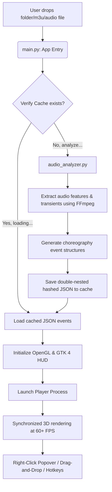

# 🌌 Melochor: 3D OpenGL Interactive Audio Visualizer

Melochor is a high-performance, real-time, hardware-accelerated 3D audio visualizer and screensaver built using **Python**, **GTK 4**, **PyOpenGL**, **NumPy**, and **FFmpeg**. 

It simulates thousands of interactive particles and beautiful procedurally generated forms that react dynamically to beats, transience, and frequency bands of your favorite music tracks.

---

## ✨ Features

### 🚀 High-Performance OpenGL Engine
- **Vectorized Particle Physics**: All trajectory calculations, gravity offsets, velocity decays, and fading alpha values are simulated using vectorized **NumPy** operations (C-speed) rather than slow Python loops, permitting **10,000+ simultaneous particles at 60–120+ FPS**.
- **Volumetric Glowing Stars**: Procedural radial gradient textures map dynamically to point-replaced sprites (`GL_POINT_SPRITE`), transforming blocky vertices into soft, glowing volumetric sparks.
- **Additive Volumetric Blending**: Overlapping particles blend additively (`GL_SRC_ALPHA`, `GL_ONE`) to make explosion centers look intensely hot and realistic.
- **Zero-Overhead Trail Buffers**: Rolling trail matrices record recent particle coordinates, rendering glowing particle tails with negligible CPU/GPU cost.

### 🎵 Intelligent Audio Synchronization
- **Precise Beat & BPM Detection**: The visualizer scans music tracks using a sophisticated multi-band sub-bass and high-frequency spectral flux analyzer, estimating BPM and mapping transients to visual fireworks and transitions.
- **Double-Stacked Hashed Caching**: Extracted choreography display scripts are saved in a double-nested directory cache structure (`fireworks_cache/h1/h2/`) under the native OS temporary path (or custom `--tmpdir`), ensuring sub-millisecond retrieval on repeat plays without cluttering user files.
- **Dynamic Playback Fail-safes**: Automatically attempts high-precision playback through a background `mpv` subprocess. If `mpv` is not installed, it falls back gracefully to standard `sounddevice` + `soundfile`/`audioread` python streams.

### 🎭 Beautiful Thematic Worlds (Presets)
Press `[V]` to cycle between, or right-click to instantly select from, five premium visualization themes:
1. **🎆 Fireworks**: Classic high-altitude pyrotechnic displays. Launches colored rockets, rings, and crackles in sync with sub-bass hits.
2. **🌀 Tunnel Wormhole**: A travel simulation through a spiraling, geometric cosmic wormhole whose walls glow, twist, and brighten gracefully with the track's beat.
3. **🌋 Underwater Lava**: A bio-luminescent marine ecosystem featuring floating bubbles, glowing algae, rising sea vents, and jellyfish that contract and pulse with mid-to-low audio frequencies.
4. **💮 Mandala Sacred**: Beautiful kaleidoscope of sacred geometry (including concentric rings and catherine wheels) that unfold, rotate, and burst on audio transience.
5. **🎛️ Synaesthesia Classic**: A minimalist flat retro display focusing purely on audio frequency spectrum meters and transient bursts.

### 🎚️ Premium Desktop Interface & Dnd
- **Recursive Drag-and-Drop**: Drag individual audio files, directories, or `.m3u` playlists directly into the window. Dropping directories automatically scans recursively for all standard music formats (`.mp3`, `.wav`, `.ogg`, `.opus`, `.flac`, `.m4a`, `.aac`).
- **Relative Playlist Resolution**: Path entries inside dropped `.m3u` playlists are automatically resolved relative to the location of the `.m3u` file.
- **Overlay HUD**: Real-time FPS, particle counts, play/pause timers, active presets, and routine indicators are rendered using high-fidelity GTK 4 overlay widgets styled with premium dark glassmorphism CSS.
- **Translucent Context Menu**: Right-click anywhere in the viewport to open a gorgeous Gtk Popover containing open buttons, play controls, next/prev track triggers, a preset checklist, and exit options.

---

## 🛠️ Installation & Setup

### 🐧 Linux (Debian/Ubuntu)
Install system GTK 4 and OpenGL drivers, then set up the python environment:

```bash
# Install GTK 4, OpenGL, and FFmpeg (for audio analysis)
sudo apt update
sudo apt install python3-gi python3-gi-cairo gir1.2-gtk-4.0 libgirepository1.0-dev ffmpeg mpv

# Set up virtual environment
python3 -m venv venv --system-site-packages
source venv/bin/activate

# Install Python requirements
pip install -r requirements.txt
```

### 🍎 macOS
Make sure you have [Homebrew](https://brew.sh/) installed, then run:

```bash
# Install GTK 4, FFmpeg, and MPV
brew install gtk4 pygobject3 ffmpeg mpv

# Create virtual environment (allow system site-packages to inherit pygobject if needed)
python3 -m venv venv --system-site-packages
source venv/bin/activate

# Install requirements
pip install -r requirements.txt
```

### 🪟 Windows
1. Install [Python 3.10+](https://www.python.org/downloads/).
2. Install [FFmpeg](https://ffmpeg.org/download.html) and add its `/bin` directory to your System PATH variables.
3. Install [GTK 4 for Windows](https://www.gtk.org/docs/installations/windows/) (e.g., via MSYS2 or standalone installer) to acquire GObject Introspection bindings.
4. Set up your environment and install Python requirements:

```cmd
python -m venv venv
venv\Scripts\activate
pip install -r requirements.txt
```

---

## 🚀 How to Run

Launch Melochor by providing files, directories, playlists, or starting with interactive audio selections:

```bash
# 1. Run with default test flac (launches immediately)
python main.py

# 2. Open a specific audio track
python main.py --audio path/to/song.mp3

# 3. Load an entire folder or .m3u playlist on startup
python main.py path/to/playlist.m3u path/to/music_folder/

# 4. Start in random preset cycle mode immediately
python main.py --random --audio path/to/song.flac

# 5. Specify a custom cache directory for analyzer scripts
python main.py --tmpdir ./my_cache_dir --audio path/to/song.ogg
```

---

## 🎮 Interactive Controls

### ⌨️ Keyboard Shortcuts
| Shortcut | Action |
| :--- | :--- |
| `[Spacebar]` / `[Media Play/Pause]` | Toggle music and choreography Play / Pause |
| `[Return / KP_Enter]` | Force launch a manual firework shell |
| `[Ctrl + F]` / `[Ctrl + O]` | Open File Dialog to load new music, folder, or playlist |
| `[F]` | Toggle Borderless Fullscreen Mode (perfect for screensavers!) |
| `[V]` | Cycle through visualization presets |
| `[A]` | Toggle Auto-Launcher (automatically launches random shells) |
| `[R]` | Toggle 3D Camera Auto-Rotation |
| `[Y]` | Toggle firework height limits (allows shells to explode at any elevation) |
| `[C]` | Clear all active visual particles from the air |
| `[H]` | Hide / Show HUD elements & key legend overlay |
| `[Left Arrow]` / `[Media Prev]` | Previous music track |
| `[Right Arrow]` / `[Media Next]` | Next music track |
| `[ESC]` / `[Q]` | Exit Melochor |

### 🖱️ Mouse Controls
- **Right-Click**: Opens the translucent Popover Menu containing player controls, mode lists, and files chooser.
- **Left-Click + Drag**: Rotate and tilt the 3D camera orbit.
- **Scroll Wheel**: Zoom the camera closer to or further from the center.

---

## 📦 Bundling with PyInstaller (Offline Portable Executable)

We package **Melochor** with static FFmpeg binaries to allow users to run visualizer analysis without requiring system FFmpeg installations.

```bash
# Build standalone frozen binary
pyinstaller --clean -y Melochor.spec
```
The output executable will be generated inside the `dist/` directory.

---

## 📝 Technical Architecture



Melochor represents a professional, highly optimized fusion of OpenGL physics and real-time audio synchronization. Enjoy the show! 🌌
